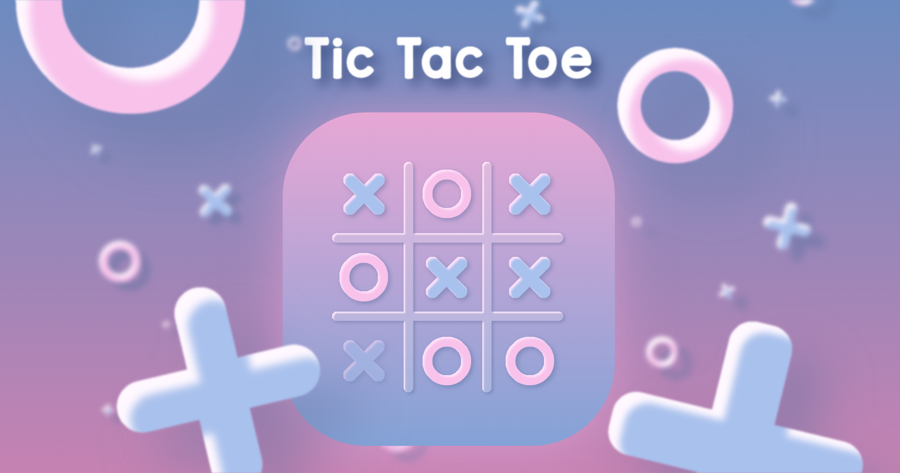

# JavaScript-Game-TicTacToe

A **Tic Tac Toe** game designed by `JavaScript`. Animated by `JavaScript` + `CSS3`.

***This project is for my personal `JS/CSS/HTML` learning purpose. All the SVGs and animations are created on my own.***

## 💡 Design

### **SVG**

SVGs are designed using the website **[Figma](https://www.figma.com/)**.

### **Font**

For font, I'm using **[KGRedHands](https://www.dafont.com/kg-red-hands.font)**.

## 🔧 Tools

- JavaScript
- HTML
- CSS
- [Figma](https://www.figma.com/) (SVG Design)
- [FontAwsome](https://fontawesome.com/) (Github/LinkedIn Icon)

## 💁‍♂️ Author

- [LinkedIn](https://www.linkedin.com/in/peng-gao-fr/) - GP
- [Github](https://github.com/RedCarpG) - RedCarpG
